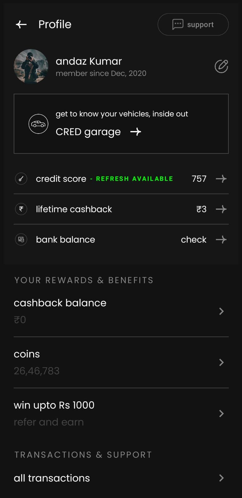

# My Android App

This is an Android app built with Jetpack Compose.

> The same UI could also be implemented using traditional XML layouts.

## Screenshots

## Tech Stack

- Kotlin
- Jetpack Compose (or XML)

## Author

**Aadil Reyaz Wani** – [@Aadil-Reyaz-Wani](https://github.com/Aadil-Reyaz-Wani)
